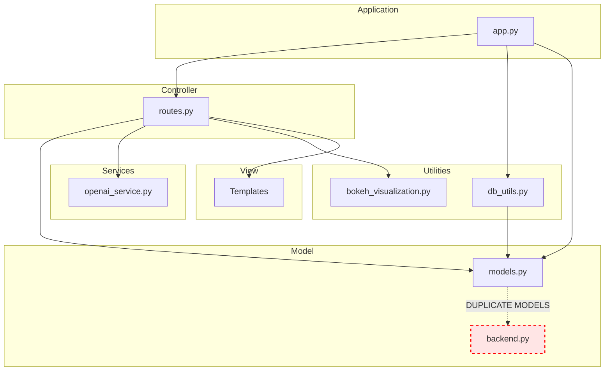

```mermaid
graph TD
  subgraph Application
    A[app.py]
  end

  subgraph Controller
    B[routes.py]
  end

  subgraph Model
    C[models.py]
    D[backend.py]:::redundant
  end

  subgraph Services
    E[openai_service.py]
  end

  subgraph Utilities
    F[db_utils.py]
    G[bokeh_visualization.py]
  end

  subgraph View
    H[Templates]
  end

  %% Dependencies
  A --> B
  A --> F
  A --> C

  B --> C
  B --> E
  B --> G
  B --> H

  F --> C

  %% Highlight redundancy
  C -.->|DUPLICATE MODELS| D
  style D fill:#ffe5e5,stroke:#ff0000,stroke-width:2px,stroke-dasharray:5
```